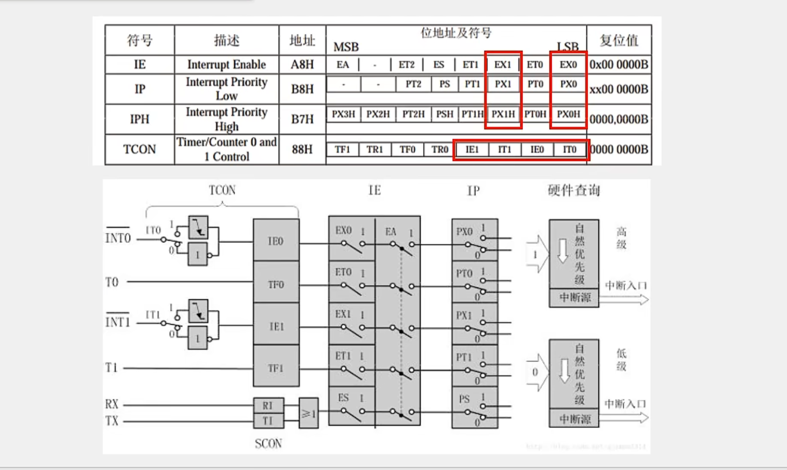

# 51单片机

## 命名规则

STC89C52系列单片机命名规则

## 各种元器件

### 发光二极管LED

TTL规定高电平为5v，低电平为0v

### 独立按键

按下时开关接通，松开时断开

实现功能有：

- 按下去亮，弹回来灭
- 按下去，弹回来一次亮，在一次灭
- 按下去弹回来一次实现二进制计数，亮的位置表示1
- 按K1按钮向左移位，按K2按钮向右移位(类似流水线等)

由于I/O口默认都是高电平，因此当我们的按钮按下去时会将低电平信号送入到寄存器

这里如果想要操作每一位寄存器而不对所有寄存器操作
使用P2_i(0-7)

由于按钮存在抖动问题，所以需要设置延时 

### 数码管

#### 静态数码管儿

它是一种显示器

数码管引脚的讲究

上面的是共阴极连接
下面的是共阳极连接

多数码管儿

但是上面存在一个问题，那就是一次只能操作一个数码管儿

#### 动态数码管儿

P22 23 24控制选择哪些数码管儿即给高电平还是低电平(3-8译码器)
P00 01-07控制选择的那些晶体管儿具体显示什么数字

### 矩阵键盘

疑问：为什么按下按键之后可以确定为哪一列？不是一直在扫描码？

### 定时器

STC89C52内部有两个定时器$T_0和T_1$, 每个定时器均有4种(0-3)模式，最常用的是模式1(16位定时器/计数器)

#### 定时器和中断系统

IE是中断使能，IP是中断优先级，TCON是中断控制

定时器分为三部分，分别是时钟、计数单元和终端系统，依次对应下图的上、下中、右

SYSclk：可以由系统时钟和外部引脚T0Pin

C/T = 0表示选择上面的内部系统时钟(timer)，为1则表示用外部的引脚即计数器(counter)

中断嵌套：cpu已在处理一个中断，又来一个等级等优先的中断则会进而去处理更紧急的中断

中断源：

#### 定时器相关寄存器

#### 定时器配置

简单任务：配置T0 
- 配置TMOD(不可位寄存器只能整体赋值)
- 配置TCON(可位寄存器，即可以进行每一位操作)
  - TCON中的TF不需要手动去写，读即可，若为1表明在请求中断，为0则CPU在处理中断
- 配置中断ET0、EA、PT0

简单任务：编写中断函数

#### 定时器中TH0和TL0的计算方法

### 串口通信

串口是专门用来传输数据的

TXD发送TRD接收

在串口中通常使用3种电平(TTL、RS232、RS485)

串口参数
波特率(串口通信速率, 即每秒钟传输多少个二进制位)、比特率、校验位、停止位

串口模式图

#### 串口相关寄存器

TI = 1(右硬件置位);则说明数据发送完成，此时需要手动将其置零，RI同理

配置：
- 配置SCON
  - 当选择模式1时，暂时不用考虑SM2，TB、RB8
- 配置SBUF(暂时不需配置)
- PCON配置
  - 设置SMOD = 1，则加倍串行通信方式123的波特率, = 0则不加倍，书中写错了(默认不加倍 )
  - SMOD0为帧错误检测有效控制位，这里选择0不开启
- 配置IE中断有关的，暂时不需要开启中断
  - EA：CPU总的中断控制位
  - 
  - ES：串口中断允许位
- 配置定时器1

单片机发送数据不需要配置中断，接受时需要中断.

### LED点阵屏

#### 74HC595

串行输入，并行输出
SER记录一位数据
SERCLK将数据整体下移
RCLK负责将完整数据运送到右边，然后并行输出

如何多片级联：
当数据满时，会将左边最后一位移动到QH'进而移动到另外一篇74HC595 

### DS1302

实时时钟相关寄存器

WP是写保护，为1则开启，表示无法写入？但是可以读取

写入的最低位是0，读取的最低位是1
读写操作：

读：
- 将CE置1，表示允许开启读
- 输入要写入地址的最低位R/W..
- 将SCLK置1，表示正式写入最低位
- 将SCLK置0
- 重复2-4

DS1302中存在的问题
- 时序图
- 读操作时最后为什么还要将IO置0

### 蜂鸣器

- 有源蜂鸣器：内部有震荡源
- 无源蜂鸣器：无

由于蜂鸣器功率较大，所以一般采用三极管进行驱动
高电平导通的NPN

### AT24C02

NPN与PNP

I2C时序结构(规定如何发送数据)
- 开始及终止

- 发送数据

SDA中两条线表示分别发送1、0，实际上只有一条

- 接收数据

主机在收受数据之前需要释放SDA即将其拉为高电平，进而转由从机控制，可以发送0或1并且同样不可改变，在SCL为高电平期间就可以读取到这些数据

- 发送应答和接收应答
发送应答由主机回复，接收应答由从机回复

- I2C数据帧
  - 发送一帧数据

S开始表示
绿色部分包含从机地址和读写操作
发送完之后立马要跟一个接收应答
  - 接收一帧数据

- 先发送后接收(复合数据帧)

- AT24C02数据帧

### DS18B02

#### 单总线时序结构

##### 初始化

##### 发送一位

若要发送一个字节则需要连续发送八位

##### 接收一位

##### 发送、接收一字节
(注意这里是无论是发送还是接收都是从低位开始的，与I2C总线相反)

#### 数据帧

### LCD1602

#### 时序结构

##### 写数据/指令
如果是数据，RS置高电平，否则为低电平

##### 指令集

##### 操作流程

### 直流电机

#### 电机调速

主要思想，调整每个周期内的占空比

#### pwm控制直流电机

##### PWM如何产生

### AD/DA
AD一般是将电压转化为数字量

能使用DA的地方一般能用PWM解决

#### 运放电路
DA原理

AD原理

#### ADC芯片时序

### 红外

#### 编码

状态机设计：  
state表示状态
0----表示为空闲状态 
1----当为0时若收到下降沿定时器打开计算时间则变为1状态